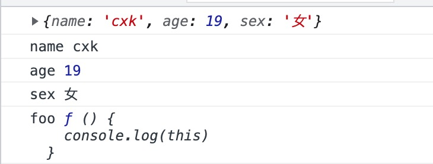
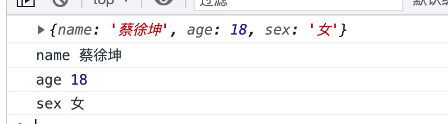

### JavaScript类的扩展 ###

******


本文介绍如何安全的扩展**JavaScript**类


先看一个例子 对**Object**类扩展 在**Object.prptotype**上增加一个函数**foo**

```javascript
Object.prototype.foo = function() {
  console.log(this)
}

const obj = {
  name: 'cxk',
  age: 19,
  sex: '女'
}

obj.show()

for(const key in obj) {
  console.log(key, obj[key])
}
```



可以看到obj.show调用成功但是在**for in**循环中会出现foo函数

参考Object.prototype.toString并不会被**for in**循环遍历出,所以我们不应该使用直接Object.prorotype.xxx = xxx来扩展

#### 使用Object.defineProperty给类的原型添加函数 ####

```js
const foo = function() {
  console.log(this)
}

Object.defineProperty(Object.prototype, 'foo', {
  value: foo, //配置的Object.prototype.foo = value
  writable: false, //不允许value被覆盖
  enumerable: false, //不允许被循环
  configrable: false //不允许被修改、删除
})

const obj = {
  name: '蔡徐坤',
  age: 18,
  sex: '女'
}

obj.foo()

for(const key in obj) {
  console.log(key, obj[key])
}
```

