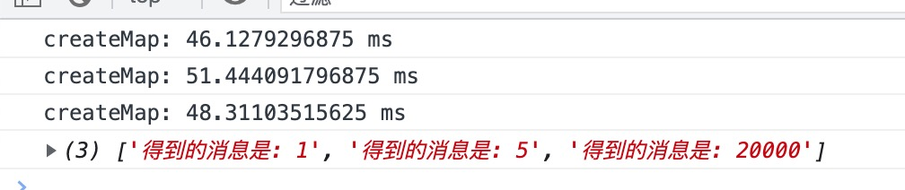
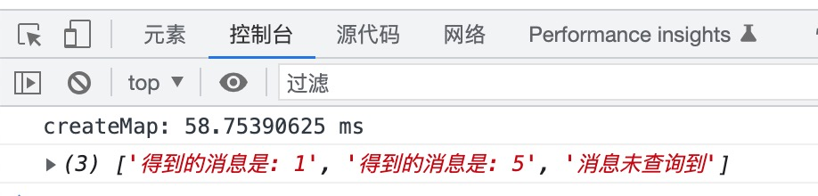

### useInit缓存函数 ###


有以下场景: 使用纯函数 传入status 得到 msg 函数内部每次都要创建一个较大开销的`map`

```javascript
const getMsg = status => {
  console.time('createMap')
  //需要较大开销去创建map
  const map = new Map(
    Array(114514).fill().map((_, i) => [i, `得到的消息是: ${i}`])
  )
  console.timeEnd('createMap')
  return map.get(status) || '消息未查询到'
}

const statusList = [1, 5, 20000]
const msgList = statusList.map(status => getMsg(status))
console.log(msgList)

```

可以看到 `createMap`执行了3次 但实际上我们只需要1次




解决方法其实可以把map的定义放在`getMsg`外面 但是这样产生了副作用 我们在外部并不需要使用map 所以 封装一个函数 `useInit` 来记忆map的定义

```javascript
/**
* @function useInit
* @description 缓存init的函数
* @param init {any} 需要被记忆的初始值 如果是函数则得到函数的结果并传入cb的init中
* @param cb {Function} (init, ...args) => any
*/
const useInit = (init, cb) => {
  const initRes = (typeof init === 'function') ? init() : init
  return cb.bind(this, initRes)
}

//demo
const getMsg = useInit(
  () => {
    console.time('createMap')
    //需要较大开销去创建map
    const map = new Map(
      Array(114514).fill().map((_, i) => [i, `得到的消息是: ${i}`])
    )
    console.timeEnd('createMap')
    const defaultMsg = '消息未查询到'
    
    //返回值会被第二个回调函数接收
    return {
      map,
      defaultMsg
    }
  },
  ({ map, defaultMsg }, status) => {
    //第一个形参是useInit传入的init 后面的...args是getMsg传入的status
    return map.get(status) || defaultMsg
  }
)

const statusList = [1, 5, 200000]
const msgList = statusList.map(status => getMsg(status))
console.log(msgList)
```



